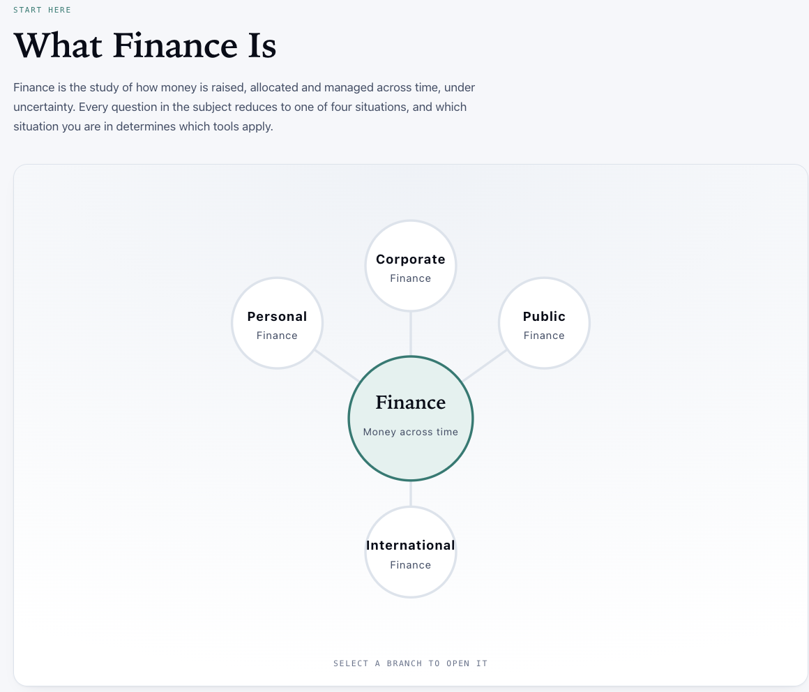
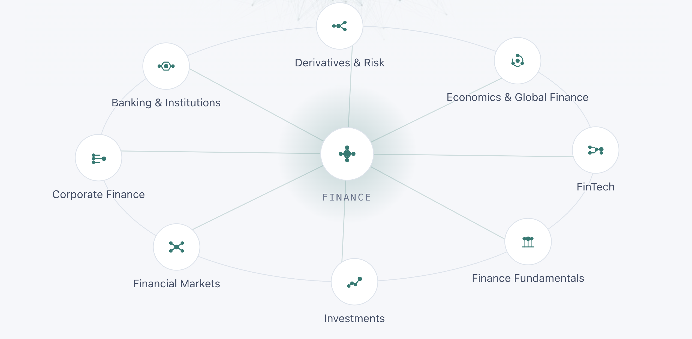
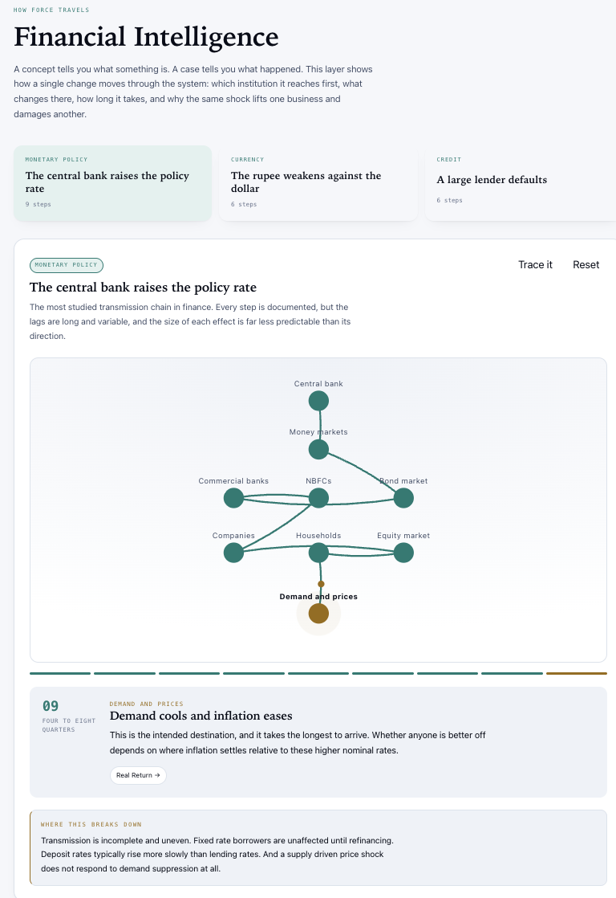
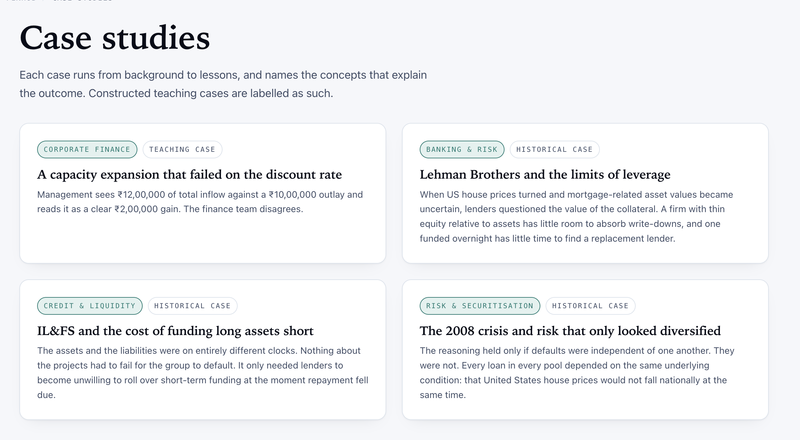
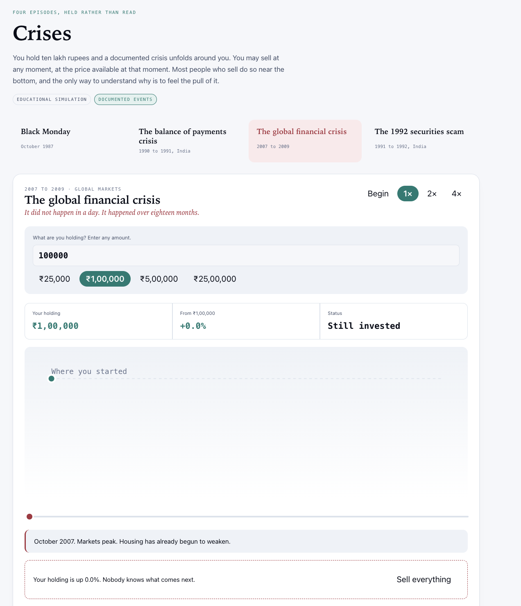
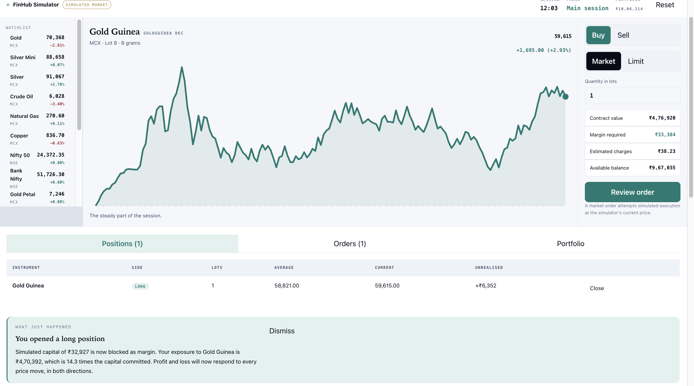
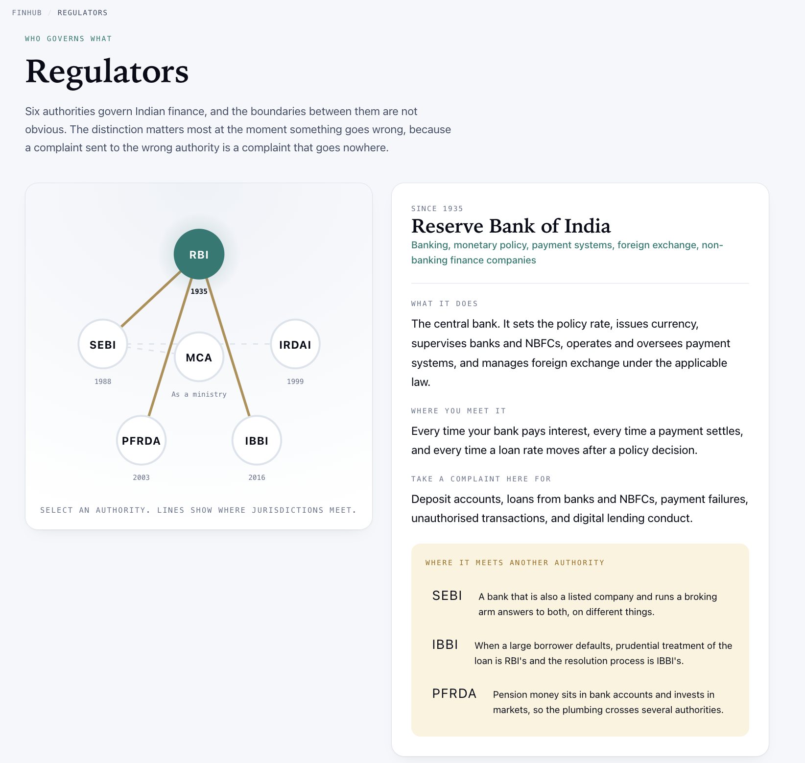
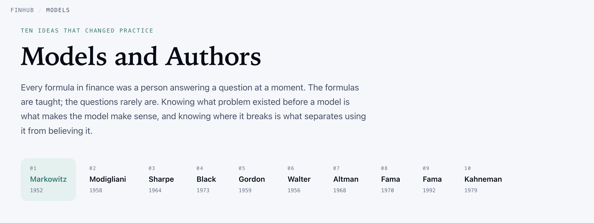
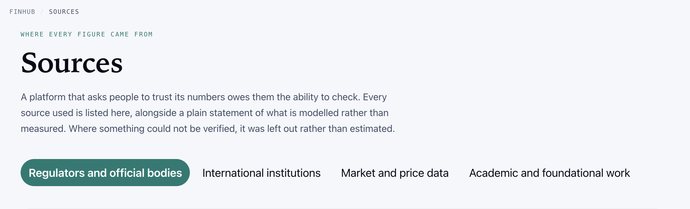
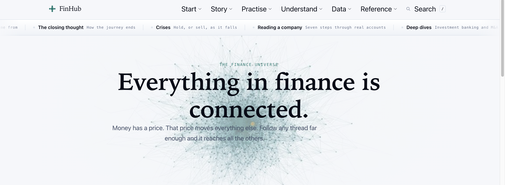

# FinHub

  

  <strong>A Finance Universe Built to Understand How Everything Connects.</strong>

  <i>"Everything in finance is connected."</i>

  <a href="https://urstrulyghc-5.github.io/finhub"><strong>🌐 Enter the Live Platform →</strong></a>

  <strong>Explore. Deep dive into FinHub. Every second spent here fetches you the worth.</strong>

---

## 1. What is FinHub?

**FinHub is an interactive finance platform built to make finance understandable as one connected system.**

Finance is rarely experienced as isolated subjects. Markets influence businesses. Businesses influence capital allocation. Monetary policy affects institutions. Institutions influence markets. Risk moves across systems. Technology changes the way financial decisions are made.

FinHub has been designed around that reality.

Instead of treating finance as a collection of definitions, formulas and disconnected chapters, FinHub brings its foundations, history, markets, institutions, technology, risk, regulation, models, crises and decision-making mechanisms into one connected environment.

The objective is simple:

> **Do not just learn what finance is. Understand how finance moves.**

---

## 2. Why FinHub Exists

Information has become abundant.

Understanding has not.

Today, almost any definition, formula or explanation can be found within seconds. The real challenge is developing the ability to understand a subject from its foundations, connect its different dimensions and recognise how one financial event affects another.

FinHub has been built from that belief.

It is a personal pursuit of **understanding, precision and excellence**, rather than a collection of pages created merely to display information.

The platform has been designed to encourage a learner to move from:

**Foundation → Connection → Mechanism → Experience → Understanding**

---

## 3. The Philosophy

### Finance is a connected system.

FinHub does not place finance into isolated boxes.

Personal finance, corporate finance, public finance and international finance exist within the same larger ecosystem.

Banking connects with markets. Markets connect with investments. Investments connect with risk. Risk connects with derivatives. Derivatives connect with institutions and regulation. Regulation connects with economic activity. And economic activity ultimately influences businesses, individuals and societies.

**FinHub exists to make those connections visible.**

---

## 4. Where It Begins

  

Before the connections can make sense, the foundation has to be laid plainly.

FinHub opens by reducing finance to four branches around a single center: Personal, Corporate, Public and International Finance, all grounded in the same idea of money moving across time.

**Nothing is assumed before the basics are in place.**

---

## 5. Enter the Finance Universe

  

The platform brings together major dimensions of finance within one interconnected universe:

| Domain | Domain | Domain | Domain |
|---|---|---|---|
| Finance Fundamentals | Corporate Finance | Investments | Financial Markets |
| Banking & Institutions | Economics & Global Finance | Derivatives & Risk | FinTech |

Each area represents a different part of finance, while remaining connected to the larger system.

The purpose is not to memorise eight domains.

**The purpose is to understand the relationship between them.**

---

## 6. From Concepts to Mechanisms

  

One of FinHub's central ideas is **Financial Intelligence**.

Knowing that an interest-rate change affects the economy is different from understanding **how** that effect travels.

FinHub therefore explores financial mechanisms as chains of transmission:

**Event → Institution → Market → Business → Decision → Economic Impact**

This approach turns financial theory into something that can be followed, questioned and understood.

---

## 7. Learn Through Reality

  

Financial concepts become clearer when they are connected to events that actually happened.

FinHub brings concepts into context through cases involving financial institutions, leverage, liquidity, market behaviour, systemic risk and financial crises.

Historical events are treated as historical events. Constructed teaching cases are identified as constructed cases.

The distinction matters because **learning should be built on clarity, not manufactured certainty.**

---

## 8. Experience Financial Crises

  

The **Crises Simulator** moves beyond simply reading about market collapses.

Users enter documented historical crises with simulated capital and experience the movement of an investment through the actual historical timeline.

The purpose is not to recreate history for entertainment. It is to understand the pressure created by:

`falling markets` · `uncertainty` · `leverage` · `fear` · `timing` · `risk` · `decision-making`

Sometimes the most important financial lesson is not knowing what happened.

**It is understanding why people made the decisions they made while it was happening.**

---

## 9. Enter the Market

  

The **FinHub Trading Simulator** provides an interactive environment for understanding market mechanics.

It brings together:

`simulated capital` · `commodities & index futures` · `watchlists` · `margin requirements` · `exposure` · `leverage` · `profit & loss` · `live-moving prices`

The objective is not to encourage trading.

The objective is to make concepts such as **margin, leverage, exposure and risk** easier to understand through interaction.

---

## 10. Understand the Institutions Behind Finance

  

Financial systems operate through institutions.

FinHub brings together India's major financial regulators and maps their respective roles, jurisdictions and areas of interaction.

The intention is to answer a practical question:

**Who is responsible for what within the financial system?**

Understanding finance also means understanding the institutions that govern it.

---

## 11. Meet the Ideas That Shaped Finance

  

Financial theory has been shaped by ideas developed to solve real problems.

FinHub connects foundational models and thinkers with the problems they attempted to understand.

The emphasis is therefore not simply:

**"Remember this formula."**

It is:

**"Understand the problem that created the formula."**

---

## 12. Built on Verifiable Understanding

  

Credibility matters.

Where financial statistics, historical figures, institutional information or academic references are used, FinHub maintains a transparent source trail.

If something cannot be established reliably, it should not be presented as established fact.

That principle is fundamental to the platform:

> **Precision before appearance.**

---

## 13. The FinHub Experience

  

FinHub has been structured as a journey rather than a collection of unrelated pages.

| Stage | What Happens |
|---|---|
| **Start** | Understand the foundations of finance |
| **Universe** | See how the major domains connect |
| **Intelligence** | Follow how financial forces travel through an economy |
| **Cases** | Connect concepts with real financial events |
| **Crises** | Experience historical market pressure through simulation |
| **Markets** | Explore market mechanics through an interactive environment |
| **Institutions** | Understand regulators and the structure behind the system |
| **Models** | Discover the ideas that shaped financial thought |
| **Sources** | Trace the foundations behind the information |

The deeper a user explores, the more connections begin to appear.

---

## 14. What Makes FinHub Different?

**It does not treat finance as a syllabus.**
**It does not treat interaction as decoration.**
**It does not treat information as understanding.**

Every major element has been designed around a purpose:

| Principle | Over |
|---|---|
| Connection | Isolation |
| Understanding | Memorisation |
| Mechanisms | Definitions |
| Evidence | Assumption |
| Experience | Passive observation |
| Clarity | Unnecessary complexity |
| Purpose | Decoration |

Animations exist to communicate. Simulations exist to demonstrate. Cases exist to provide context. Sources exist to establish credibility. The design exists to support the experience.

---

## 15. About the Founder

**G Hari Charan** is the founder, designer and sole builder of FinHub.

FinHub was conceived, researched, designed and developed entirely independently, with sole ownership of the platform, its concept and its content. It is not an open codebase; access is intended strictly through the live experience itself.

**LinkedIn:** [linkedin.com/in/gharicharan](https://www.linkedin.com/in/gharicharan)

The platform represents an approach to learning that begins with a simple question:

> **If everything in finance is connected, why should the way we learn finance be disconnected?**

FinHub is the attempt to answer that question.

---

  

  <strong>FinHub</strong> 
  A platform built to understand finance as one connected system.

  <i>Built, designed and curated by G Hari Charan.</i>

